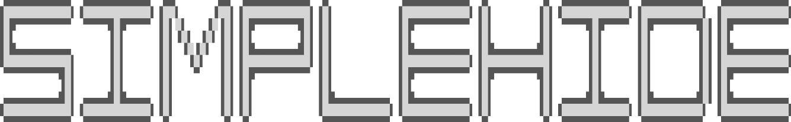

SimpleHide is small and simple software to hide secret data within another data

### Table of content

- [Table of content](#table-of-content)
- [Hiding algorithm](#hiding-algorithm)
- [Extracting algorithm](#extracting-algorithm)
- [How to build code](#how-to-build-code)
- [Usage](#usage)
- [3rd party libraries](#3rd-party-libraries)

### Hiding algorithm

**Disclaimer**

Simplehide is a software, based on **simplehide-lib** and [3rd party libraries](#3rd-party-libraries). [3rd party libraries](#3rd-party-libraries) are used "as-is" to decode and encode input/output data as human-recognizable file, such as \*.png, \*.jpeg etc.

Basically, all "new" hiding work is done via **simplehide-lib**. That is why file encoding/decoding will not be described.

As inputs algorithm takes 3 arguments: input data array, secret data array and a mask - 1-byte unsigned number.
Secret data must be considerably smaller than input data. The bigger the difference - the better, but is up to user to decide how much data they want to hide.

Let's take **Hello, World!** as binary input for secret data as an example with mask **0x1B**

1. Parsing a mask:

A mask is a parameter, that decides how many secret bits will be hidden inside input data's byte. Mask parsing is to simply decide how many bits are set. Currently mask support a power of 2 set bits: 1, 2, 4 or 8.
The number of set bits in a mask decides in how many parts will secret data's byte be split.

If 1 bit is set - byte will be split into 8 parts; 2 bits - byte will be split into 4 parts and so on.

**0x1B** is 00011011 in binary. It has 4 set bits, so secret data bytes will be split into 2 parts.

2. Putting hiding data size into first bytes:

Data size is 14 (1110) for given example

    [ 0]: 0xff -> 0xfe (0)
    [ 1]: 0xff -> 0xff (1)
    [ 2]: 0xff -> 0xff (1)
    [ 3]: 0xff -> 0xff (1)
    [ 4]: 0xff -> 0xfe (0)
    [ 5]: 0xff -> 0xfe (0)
    [ 6]: 0xff -> 0xfe (0)
    [ 7]: 0xff -> 0xfe (0)
    [ 8]: 0xff -> 0xfe (0)
    [ 9]: 0xff -> 0xfe (0)
    [10]: 0xff -> 0xfe (0)
    [11]: 0xff -> 0xfe (0)
    [12]: 0xff -> 0xfe (0)
    [13]: 0xff -> 0xfe (0)
    [14]: 0xff -> 0xfe (0)
    [15]: 0xff -> 0xfe (0)
    [16]: 0xff -> 0xfe (0)
    [17]: 0xff -> 0xfe (0)
    [18]: 0xff -> 0xfe (0)
    [19]: 0xff -> 0xfe (0)
    [20]: 0xff -> 0xfe (0)
    [21]: 0xff -> 0xfe (0)
    [22]: 0xff -> 0xfe (0)
    [23]: 0xff -> 0xfe (0)
    [24]: 0x55 -> 0x54 (0)
    [25]: 0x55 -> 0x54 (0)
    [26]: 0x55 -> 0x54 (0)
    [27]: 0xff -> 0xfe (0)
    [28]: 0x55 -> 0x54 (0)
    [29]: 0x55 -> 0x54 (0)
    [30]: 0x55 -> 0x54 (0)
    [31]: 0xff -> 0xfe (0)
    [32]: 0x55 -> 0x54 (0)
    [33]: 0x55 -> 0x54 (0)
    [34]: 0x55 -> 0x54 (0)
    [35]: 0xff -> 0xfe (0)
    [36]: 0x55 -> 0x54 (0)
    [37]: 0x55 -> 0x54 (0)
    [38]: 0x55 -> 0x54 (0)
    [39]: 0xff -> 0xfe (0)
    [40]: 0x55 -> 0x54 (0)
    [41]: 0x55 -> 0x54 (0)
    [42]: 0x55 -> 0x54 (0)
    [43]: 0xff -> 0xfe (0)
    [44]: 0x55 -> 0x54 (0)
    [45]: 0x55 -> 0x54 (0)
    [46]: 0x55 -> 0x54 (0)
    [47]: 0xff -> 0xfe (0)
    [48]: 0x55 -> 0x54 (0)
    [49]: 0x55 -> 0x54 (0)
    [50]: 0x55 -> 0x54 (0)
    [51]: 0xff -> 0xfe (0)
    [52]: 0x55 -> 0x54 (0)
    [53]: 0x55 -> 0x54 (0)
    [54]: 0x55 -> 0x54 (0)
    [55]: 0xff -> 0xfe (0)
    [56]: 0x55 -> 0x54 (0)
    [57]: 0x55 -> 0x54 (0)
    [58]: 0x55 -> 0x54 (0)
    [59]: 0xff -> 0xfe (0)
    [60]: 0x55 -> 0x54 (0)
    [61]: 0x55 -> 0x54 (0)
    [62]: 0x55 -> 0x54 (0)
    [63]: 0xff -> 0xfe (0)

3. Hiding mask

The same algorith is for mask - it hidden at first 8 bytes of input data at every second bit.

Note: mask may not be hidden as well

4. Secret data splitting:

As mask has 4 set bits, secret data will be split in halves. Note, initial 13 bytes will now require 26 bytes to store data.

**Hello, World!**:

     Hex        Binary                     Hex           Binary
    0x48       01001000        ->        0x8 0x4       1000 0100
    0x65       01100101        ->        0x5 0x6       0101 0110
    0x6c       01101100        ->        0xc 0x6       1100 0110
    0x6c       01101100        ->        0xc 0x6       1100 0110
    0x6f       01101111        ->        0xf 0x6       1111 0110
    0x2c       00101100        ->        0xc 0x2       1100 0010
    0x20       00100000        ->        0x0 0x2       0000 0010
    0x57       01010111        ->        0x7 0x5       0111 0101
    0x6f       01101111        ->        0xf 0x6       1111 0110
    0x72       01110010        ->        0x2 0x7       0010 0111
    0x6c       01101100        ->        0xc 0x6       1100 0110
    0x64       01100100        ->        0x4 0x6       0100 0110
    0x21       00100001        ->        0x1 0x2       0001 0010

Note: less signifficant bits went in less signifficant byte!

6. Apply mask to each byte:

Inside a code this process is referred as "remasking". Remasking is a process of rearranging of bits in correspondance to set mask bits. Let's see on example:

    Mask = 0x1B = 00011011    Mask = 0x1B = 00011011    Mask = 0x1B = 00011011    Mask = 0x1B = 00011011    Mask = 0x1B = 00011011    Mask = 0x1B = 00011011
    0x1B = 0 0 0 1 1 0 1 1    0x1B = 0 0 0 1 1 0 1 1    0x1B = 0 0 0 1 1 0 1 1    0x1B = 0 0 0 1 1 0 1 1    0x1B = 0 0 0 1 1 0 1 1    0x1B = 0 0 0 1 1 0 1 1
    0x08 = 0 0 0 0 1 0 0 0    0x04 = 0 0 0 0 0 1 0 0    0x05 = 0 0 0 0 0 1 0 1    0x06 = 0 0 0 0 0 1 1 0    0x0C = 0 0 0 0 1 1 0 0    0x0F = 0 0 0 0 1 1 1 1
                  / /  | |                  / /  | |                  / /  | |                  / /  | |                  / /  | |                  / /  | |
    0x10 = 0 0 0 1 0 0 0 0    0x08 = 0 0 0 0 1 0 0 0    0x09 = 0 0 0 0 1 0 0 1    0x0A = 0 0 0 0 1 0 1 0    0x18 = 0 0 0 1 1 0 0 0    0x1B = 0 0 0 1 1 0 1 1

And in case of a bit different mask:

    Mask = 0x33 = 00011011    Mask = 0x33 = 00011011    Mask = 0x33 = 00011011    Mask = 0x33 = 00011011    Mask = 0x33 = 00011011    Mask = 0x33 = 00011011
    0x33 = 0 0 1 1 0 0 1 1    0x33 = 0 0 1 1 0 0 1 1    0x33 = 0 0 1 1 0 0 1 1    0x33 = 0 0 1 1 0 0 1 1    0x33 = 0 0 1 1 0 0 1 1    0x33 = 0 0 1 1 0 0 1 1
    0x08 = 0 0 0 0 1 0 0 0    0x04 = 0 0 0 0 0 1 0 0    0x05 = 0 0 0 0 0 1 0 1    0x06 = 0 0 0 0 0 1 1 0    0x0C = 0 0 0 0 1 1 0 0    0x0F = 0 0 0 0 1 1 1 1
                  / /  | |                  / /  | |                  / /  | |                  / /  | |                  / /  | |                  / /  | |
                 / /   | |                 / /   | |                 / /   | |                 / /   | |                 / /   | |                 / /   | |
                / /    | |                / /    | |                / /    | |                / /    | |                / /    | |                / /    | |
    0x20 = 0 0 1 0 0 0 0 0    0x01 = 0 0 0 1 0 0 0 0    0x11 = 0 0 0 1 0 0 0 1    0x12 = 0 0 0 1 0 0 1 0    0x30 = 0 0 1 1 0 0 0 0    0x33 = 0 0 1 1 0 0 1 1

And so on. As a result every byte will be remasked to next data:

       Hex            Binary                  Hex           Binary
    0x08 0x04   00001000 00000100    ->    0x10 0x08   00010000 00001000
    0x05 0x06   00000101 00000110    ->    0x09 0x0a   00001001 00001010
    0x0c 0x06   00001100 00000110    ->    0x18 0x0a   00011000 00001010
    0x0c 0x06   00001100 00000110    ->    0x18 0x0a   00011000 00001010
    0x0f 0x06   00001111 00000110    ->    0x1b 0x0a   00011011 00001010
    0x0c 0x02   00001100 00000010    ->    0x18 0x02   00011000 00000010
    0x00 0x02   00000000 00000010    ->    0x00 0x02   00000000 00000010
    0x07 0x05   00000111 00000101    ->    0x0b 0x09   00001011 00001001
    0x0f 0x06   00001111 00000110    ->    0x1b 0x0a   00011011 00001010
    0x02 0x07   00000010 00000111    ->    0x02 0x0b   00000010 00001011
    0x0c 0x06   00001100 00000110    ->    0x18 0x0a   00011000 00001010
    0x04 0x06   00000100 00000110    ->    0x08 0x0a   00001000 00001010
    0x01 0x02   00000001 00000010    ->    0x01 0x02   00000001 00000010

7. Find hiding step

Hiding step is calculated with following formula

    stepSize = (rawDataSize - BITS_SIZE_T) / (hiddenMaskedDataSize + 1);

rawDataSize          - input data size;
BITS_SIZE_T          - bits in size_t (64 bits in my case)
hiddenMaskedDataSize - remasked data size (26 in example above)

8. Hide secret data

At first - clean set mask bits in every input data **i \* stepSize** byte. **i** is a whole number from 1 to hiddenMaskedDataSize

### Extracting algorithm

Extracting is basically the same process, but reverted.
When mask is not hidden - user must provide it. When data size is not hidden - only God can help you.

### How to build code

1. Create new folder for binary files

        mkdir build
        cd build

2. Configure build

        cmake ..                                # For default configuration (Release)
        cmake .. -DCMAKE_build_TYPE=Release     # For release configuration (default)
        cmake .. -DCMAKE_BUILD_TYPE=Debug       # For debug configuration

3. Compile software

        make -j $(nproc --all)

4. Test software

        cd bin
        ./run_test

### Usage

Software should have at least 2 argument for hiding data:

    ./simplehide -i input_file.png -s secret_file                # input_file_output.png file will be created

Or one can specify output file:

    ./simplehide -i input_file.png -s secret_file -o output_file # output_file.png file will be created

To extract hidden data use **-e** key:

    ./simplehide -i input_file.png -o output_file -e

Specify mask with **-m** key:

    ./simplehide -i input_file.png -s secret_file -o output_file -m 18

To get more datails on usage - use **-h** or **--help** keys or plain program call:

    ./simplehide -h
    ./simplehide

### Limitations

This software is currently in development and only support limited number of input/output file formats:

- Inputs:
    - png
    - txt
    - bin
    - \<no format\>

### 3rd party libraries

- [LodePNG](https://github.com/lvandeve/lodepng)
